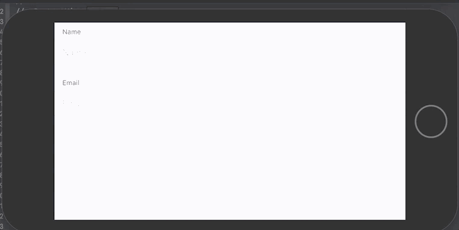

# SwiftUIValidations


[](https://codecov.io/gh/m-housh/SwiftUIValidations)


A swift package that adds validation to views.




## Installation
-------------------------
Add to your project using `swift package manager`.

## Basic Usage
--------------------------

There are 3 main things this package exposes. `Validator`, `ValidatingTextField`, and an `errorModifier` view modifiier.

### ValidatingTextField

The validatable text field is similar to a normal text field however it adds the abilitiy to validate the text value, and display an error message(s) if invalid.  There are two ways to create a validatable text field.

You can use a single validator, or combine validators with `&&`, `||`, and `!` operators.

``` swift
    
struct ContentView: View {
    
    @State private var nameText: String
    @State private var emailText: String
    
    var body: some View {
        Form {
            ValidatingTextField("Name", text: $nameText, validator: !.empty && .count(5...))
            ValidatingTextField("Email", text: $emailText) {
                !.empty && .email
            }
        }
    }
}
```

### errorModifier

The `errorModifier` is an extension on `View` and will add the ability for any view to be validated.  There are several ways to create add an error modifier to a view, below is just one example of using a key path on `Validators` to derive the validation from.

```swift

struct MyValidatableView: View {

    // control when the error is evaluated.
    @State private var shouldEvaluate: Bool = true
    
    @State private var value: String = ""
    
    var body: some View {
        Form {
            // display the error in the section header.
            Section(header: errorView) {
                TextField("Value", text: $value)
            }
        }
    }
    
    private var errorView: some View {
        Text("")
            .errorModifier(value: $value, shouldEvaluate: $shouldEvaluate, validator: !.empty)
    }
}

```

### Validator

`Validator` is a type that can validate a `Binding` value on a view.  

A validator holds the text to be displayed and the validation method.  A validator also has the ability to be combined with other validators, making a chain of error messages that will be displayed, depending on the result.

Validators can be combined with the following operators `&&`, `||`, and `!` .

-   `&&`:  Combine two validators together using `AND`
-   `||`:  Combine two validators together using `OR`
-   `!`:  Use the inverse of a validator using `NOT`

## Documentation
-------------------------------

See the [Documentation](https://m-housh.github.io/SwiftUIValidations) for available validators.
